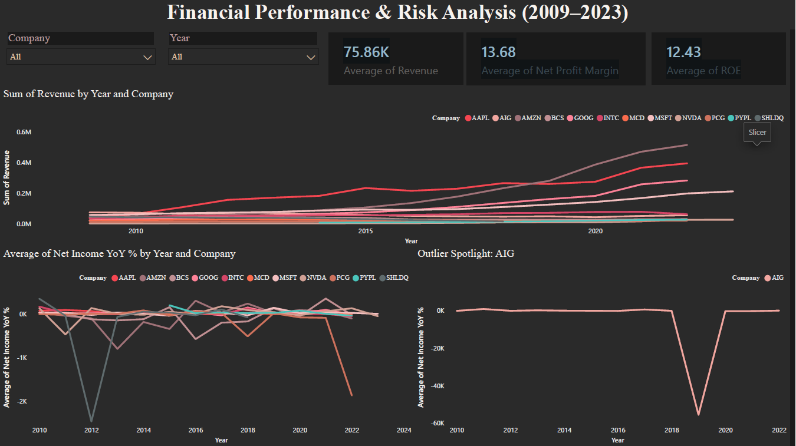
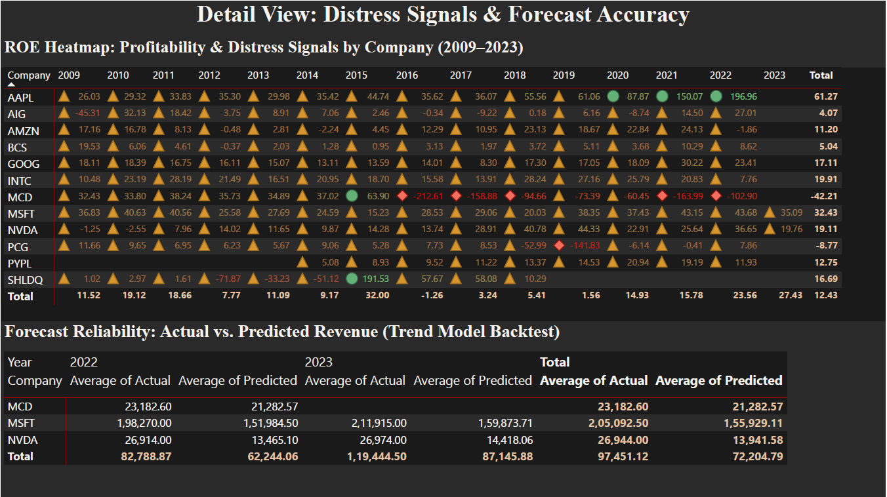

# Financial Performance & Ratio Analysis (2009–2023)

> A 10-K-based financial analysis project covering 12 major companies (2009–2023) — 
> demonstrating ratio analysis, distress detection, and forecast reliability testing 
> for a Financial Analyst role.

## Table of Contents
- [Objective](#objective)
- [Dataset](#dataset)
- [Tools Used](#tools-used)
- [Methodology](#methodology)
- [Key Insight](#key-insight)
- [Dashboard](#dashboard)
- [Repository Structure](#repository-structure)

---

## Objective
Evaluate 15 years of financial statements to answer two questions: what do 
deteriorating versus healthy financial trends look like in the underlying ratios, 
and how reliable is a simple trend-based forecast when a company's growth 
trajectory shifts structurally?

---

## Dataset
- **Source:** [Financial Statements of Major Companies (2009–2023)](https://www.kaggle.com/datasets/rish59/financial-statements-of-major-companies2009-2023) — Kaggle, sourced from 10-K filings
- **Coverage:** 12 companies (AAPL, MSFT, GOOG, AMZN, NVDA, INTC, PYPL, AIG, BCS, MCD, PCG, SHLDQ), 2009–2023
- **Fields:** Revenue, Net Income, EBITDA, Shareholder Equity, Cash Flow (Operating / Investing / Financing), and pre-calculated ratios (Current Ratio, Debt/Equity, ROE, ROA, ROI, Net Profit Margin)

---

## Tools Used
| Tool | Role |
|---|---|
| **Excel** | Initial data inspection |
| **Python (Pandas, scikit-learn)** | Data cleaning, ratio validation, YoY/trend analysis, backtested forecasting |
| **Power BI** | Two-page interactive dashboard |

---

## Methodology

**1. Cleaning** — standardised inconsistent category labels (e.g., `BANK` → `Bank`)

**2. Ratio validation** — recomputed **Net Profit Margin** and **ROE** from raw line items and confirmed against the dataset's pre-built ratio columns

**3. Trend & distress analysis** — YoY analysis across all companies, with three distress case studies:
- **PCG (Utilities)** — sudden shock: 2018 wildfire liability crisis; ROE collapsed to **-52.99%**, recovered by 2022
- **AIG (Finance)** — systemic crisis with bailout: 2009 financial crisis low of **-45.31% ROE**, rapid recovery
- **SHLDQ (Retail)** — slow structural decline: seven consecutive years of revenue decline, negative Shareholder Equity from 2015, bankruptcy in 2018

**4. Growth divergence** — NVDA vs. INTC, same sector, opposite 2021–2022 trajectories (**+61%** vs. **-20%** revenue growth)

**5. Backtested forecasting** — linear trend model trained on 2009–2021 data, tested against 2022–2023 actuals:

| Company | Profile | Forecast Error |
|---|---|---|
| MCD | Stable, mature | **-8.2%** |
| MSFT | Moderate acceleration (cloud/AI) | **-23.3%** |
| NVDA | Structural break (AI/GPU boom) | **-50.0%** |

---

## Key Insight
Forecast accuracy degrades in direct proportion to how much a company's growth 
trajectory structurally inflected. Simple trend models perform well for stable, 
mature businesses but systematically underestimate companies undergoing genuine 
disruption — a distinction that matters more for an analyst than the forecast 
number itself.

---

## Dashboard

**Page 1 — Executive Summary:** KPI cards, Revenue trend by company, Net Income 
YoY % (with an isolated AIG outlier-spotlight view)

**Page 2 — Ratio Heatmap & Forecast Validation:** Conditional-formatted ROE 
heatmap across all companies and years, Actual vs. Predicted revenue backtest table

---

## Repository Structure
data/ raw and cleaned datasets
notebooks/ Jupyter notebook — cleaning, validation, analysis, forecasting
dashboard/ Power BI file and dashboard screenshots
outputs/ backtest results export

---

## Author
**Bhanu Prakash Jajapuram**

Business Analyst / Power BI Developer
